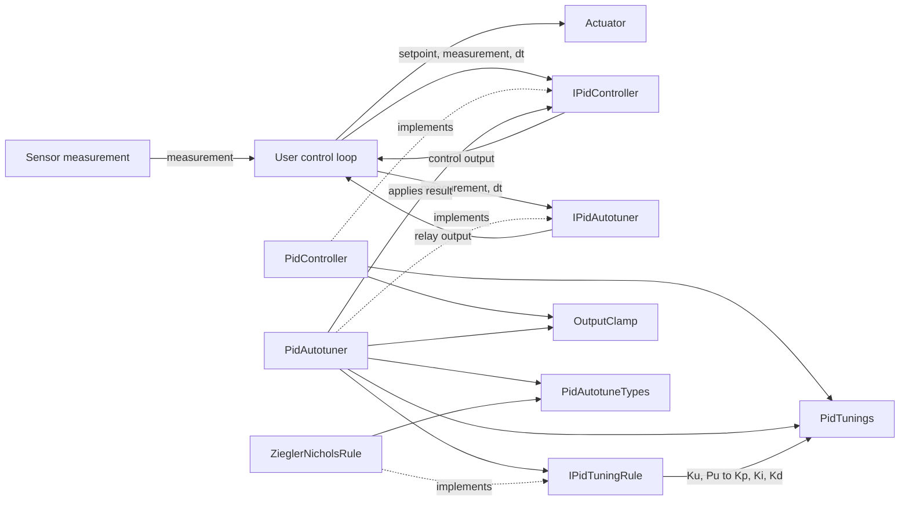
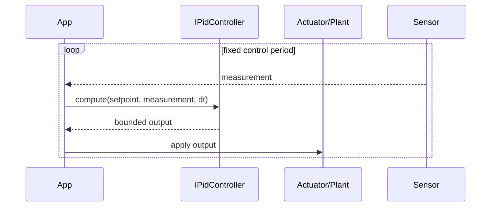
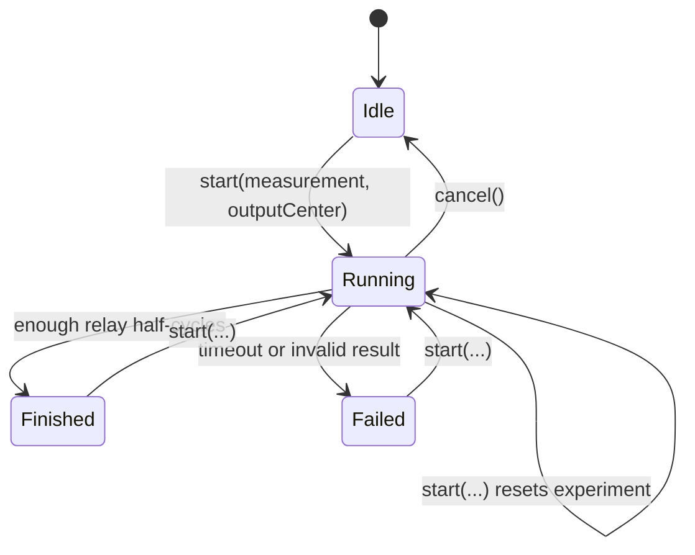

# PIDReg — AI/RAG context map

This file is a compact, retrieval-friendly description of the repository for
AI coding assistants. Treat the source files as the final authority when this
document and the code disagree.

## Repository identity

- Package: `PIDReg`
- Current manifest version: `1.2.0`
- Language: C++ (Arduino/PlatformIO-compatible)
- Core algorithm dependency on Arduino: none
- License: MIT
- Purpose: PID control, relay autotuning, and replaceable tuning strategies
- Default local verification target: ESP32 Wokwi simulation

## Architecture graph



## Runtime flows

### Normal PID control



`PidController` calculates error as `setpoint - measurement`. Its derivative
term is based on error, so setpoint changes can cause derivative kick. `dt` is
in seconds. If `dt <= 0` or is not finite, `compute()` returns the previous
output and does not update state.

### Relay autotune



While `Running`, the application must use `PidAutotuner::update()` instead of
`PidController::compute()` and apply the returned relay output to the actuator.
After `Finished`, call `applyTunings()` to write the result to the injected
`IPidController` and reset its internal state.

The tuner estimates:

```text
Pu = 2 * average half-period
Ku = 4 * outputStep / (pi * average oscillation amplitude)
```

It then delegates `Ku, Pu -> PidTunings` to `IPidTuningRule`.

## Public API index

| Symbol | File | Responsibility |
|---|---|---|
| `IPidController` | `src/IPidController.h` | PID abstraction |
| `PidController` | `src/PidController.h/.cpp` | Classic PID implementation |
| `PidTunings` | `src/PidTunings.h` | Value object containing `kp`, `ki`, `kd` |
| `IPidAutotuner` | `src/IPidAutotuner.h` | Autotuner abstraction |
| `PidAutotuner` | `src/PidAutotuner.h/.cpp` | Relay experiment and Ku/Pu estimation |
| `IPidTuningRule` | `src/IPidTuningRule.h` | Strategy for converting Ku/Pu to gains |
| `ZieglerNicholsRule` | `src/ZieglerNicholsRule.h/.cpp` | Built-in tuning strategies |
| `PidAutotuneState` | `src/PidAutotuneTypes.h` | Idle/Running/Finished/Failed |
| `PidAutotuneRule` | `src/PidAutotuneTypes.h` | Built-in rule identifiers |
| `OutputClamp` | `src/OutputClamp.h` | Shared output limiting helper |

## Built-in tuning rules

Given ultimate gain `Ku` and period `Pu`:

| Rule | Kp | Ti | Td | Ki | Kd |
|---|---:|---:|---:|---:|---:|
| `ClassicPid` | `0.60 Ku` | `0.50 Pu` | `0.125 Pu` | `Kp / Ti` | `Kp * Td` |
| `PessenIntegral` | `0.70 Ku` | `0.40 Pu` | `0.15 Pu` | `Kp / Ti` | `Kp * Td` |
| `SomeOvershoot` | `0.33 Ku` | `0.50 Pu` | `0.33 Pu` | `Kp / Ti` | `Kp * Td` |
| `NoOvershoot` | `0.20 Ku` | `0.50 Pu` | `0.33 Pu` | `Kp / Ti` | `Kp * Td` |
| `PiOnly` | `0.45 Ku` | `0.83 Pu` | `0` | `Kp / Ti` | `0` |

## Ownership and invariants

- `PidAutotuner` stores references/pointers to the injected `IPidController`
  and `IPidTuningRule`; those objects must outlive the tuner.
- The library performs no dynamic allocation.
- `setOutputLimits(min, max)` swaps reversed arguments.
- Output limiting is disabled until `setOutputLimits()` is called.
- The caller must provide finite setpoints, measurements, gains, and limits.
- `PidController::setTunings()` preserves accumulated state; `reset()` is
  explicit. Setting output limits immediately clamps integral and last output.
- `setOutputStep()` and `setNoiseBand()` store absolute values.
- `setSettleCycles()` enforces a minimum of four half-cycles.
- Negative timeout values become `0`; timeout `0` means no timeout.
- `start()` may be called from any state and resets prior experiment data.
- `cancel()` changes state only from `Running`; `update()` outside `Running`
  returns the last relay output.
- Built-in and custom tuning rule setters replace the same active strategy.
- `applyTunings()` has no effect unless state is `Finished`.
- Leaving `Running` does not force a safe actuator output. After cancel,
  success, or failure, the application must select the next output.
- Tunings are not persisted to EEPROM/NVS; the application owns persistence.
- Classes are stateful and are not thread-safe.

## Extension points

### Add a custom tuning rule

Implement `IPidTuningRule::compute(float ku, float pu)`, keep the strategy
object alive, then inject it through `IPidAutotuner::setTuningRule()`.
Do not modify `PidAutotuner` for a new conversion formula.

### Add a different autotune algorithm

Implement `IPidAutotuner`. The application can keep using the same orchestration
code and `IPidController`.

### Add a different PID implementation

Implement `IPidController`. It can be used by `PidAutotuner` as long as it
honors the interface contract.

## Retrieval guide

Use these file groups for focused retrieval:

- PID calculation: `IPidController.h`, `PidController.h`,
  `PidController.cpp`, `PidTunings.h`, `OutputClamp.h`
- Autotune state machine: `IPidAutotuner.h`, `PidAutotuner.h`,
  `PidAutotuner.cpp`, `PidAutotuneTypes.h`
- Tuning formulas: `IPidTuningRule.h`, `ZieglerNicholsRule.h`,
  `ZieglerNicholsRule.cpp`
- Integration examples: `examples/Basic/Basic.ino`,
  `examples/Autotune/Autotune.ino`
- Wokwi integration: `examples/Wokwi/Wokwi.ino`, `diagram.json`,
  `wokwi.toml`, `platformio.ini`
- Packaging: `library.json`, `library.properties`
- Human documentation: `README.md`, `README.ru.md`

## Change checklist for AI agents

1. Preserve Arduino-compatible C++ and avoid unnecessary dynamic allocation.
2. Keep `dt` units in seconds across interfaces, code, examples, and docs.
3. Update both `README.md` and `README.ru.md` for public API changes.
4. Update `library.json`, `library.properties`, and `keywords.txt` when public
   symbols or versions change.
5. Update this context map when architecture or ownership changes.
6. Build the Wokwi example with `pio run -e wokwi` before proposing a release.
7. Do not commit `.pio/` or IDE-generated files.
